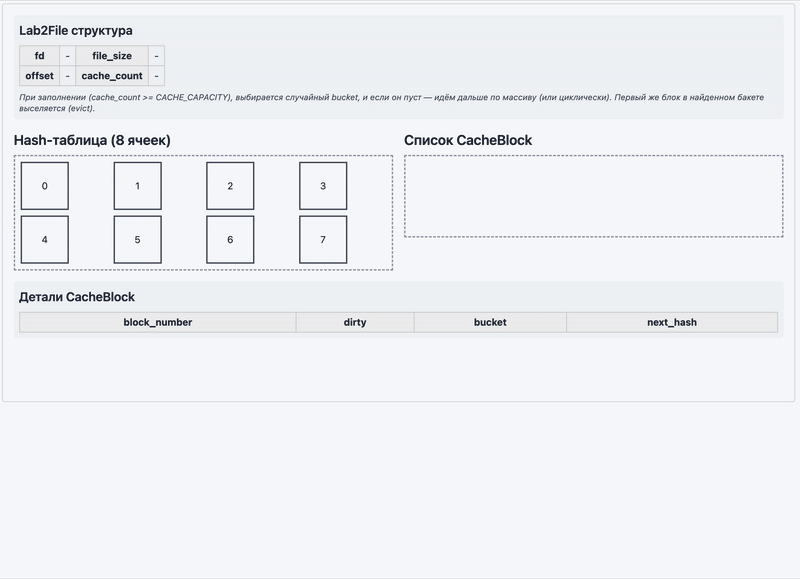

# Лабораторная работа №2
## Лукьянчук Ярослав P3323 (367361)
```json
{
  "target_os": "Linux",
  "cache_policy": "LRU"
}
```

## Мои результаты

```bash
       _,met$$$$$gg.          debian@debian 
    ,g$$$$$$$$$$$$$$$P.       ------------- 
  ,g$$P"     """Y$$.".        OS: Debian GNU/Linux 12 (bookworm) aarch64 
 ,$$P'              `$$$.     Host: QEMU Virtual Machine virt-7.2 
',$$P       ,ggs.     `$$b:   Kernel: 6.1.0-28-arm64 
`d$$'     ,$P"'   .    $$$    Uptime: 1 hour, 49 mins 
 $$P      d$'     ,    $$P    Packages: 1670 (dpkg) 
 $$:      $$.   -    ,d$$'    Shell: bash 5.2.15 
 $$;      Y$b._   _,d$P'      Resolution: 1800x1126 
 Y$$.    `.`"Y$$$$P"'         DE: GNOME 43.9 
 `$$b      "-.__              WM: Mutter 
  `Y$$                        WM Theme: Adwaita 
   `Y$$.                      Theme: Adwaita [GTK2/3] 
     `$$b.                    Icons: Adwaita [GTK2/3] 
       `Y$$b.                 Terminal: vscode 
          `"Y$b._             CPU: (6) 
              `"""            GPU: 00:02.0 Red Hat, Inc. Virtio 1.0 GPU 
                              Memory: 1750MiB / 3921MiB 

===================================================
              Performance Test Suite                 
===================================================

Test 1: LRU Cache Performance Test
Description: Evaluating cache performance with different
file sizes and access patterns (sequential and random)
===================================================

Size(MB) | Mode  | Run | no_cache(ms) | with_cache(ms)
------------------------------------------------------
256      | seq |  1  | 556.99       | 121.61
256      | seq |  2  | 180.57       | 82.68
256      | seq |  3  | 144.44       | 97.06
256      | rand |  1  | 131.31       | 63.39
256      | rand |  2  | 107.42       | 74.26
256      | rand |  3  | 184.01       | 84.68
512      | seq |  1  | 269.37       | 145.71
512      | seq |  2  | 262.25       | 144.72
512      | seq |  3  | 213.70       | 128.11
512      | rand |  1  | 185.56       | 123.67
512      | rand |  2  | 187.56       | 123.31
512      | rand |  3  | 185.75       | 126.48
1024      | seq |  1  | 620.01       | 1760.32
1024      | seq |  2  | 553.51       | 1338.44
1024      | seq |  3  | 508.06       | 1708.58
1024      | rand |  1  | 377.81       | 1088.60
1024      | rand |  2  | 401.16       | 1119.03
1024      | rand |  3  | 365.50       | 1095.07

===================================================
Test 2: External Integer Sorting Test
Description: Testing the performance of external
merge sort implementation for integer arrays
===================================================
 total_ints | chunk_size |   sys_time(ms)  |  lab2_time(ms)
------------+------------+-----------------+----------------
      20000 |       2000 |           57.36 |           5.99
      50000 |       5000 |          140.39 |          12.77
     100000 |      10000 |          254.05 |          27.84
```

## Анимация моей работы




<!-- [Отчёт](./reports/REPORT.md)  
[Отчёт PDF](./reports/report.pdf) -->

---

## Задание

В данной лабораторной работе необходимо реализовать блочный кэш в пространстве пользователя в виде динамической библиотеки (**.so**). Политику вытеснения (в данном случае **LRU**) и другие элементы задания определяет преподаватель.

API библиотеки должно предоставлять следующие функции:
- **Открытие файла**: `int lab2_open(const char *path);`
- **Закрытие файла**: `int lab2_close(int fd);`
- **Чтение**: `ssize_t lab2_read(int fd, void *buf, size_t count);`
- **Запись**: `ssize_t lab2_write(int fd, const void *buf, size_t count);`
- **Перестановка позиции**: `off_t lab2_lseek(int fd, off_t offset, int whence);`
- **Синхронизация данных**: `int lab2_fsync(int fd);`

Операции с диском должны производиться с использованием `O_DIRECT`, в обход системного **page cache**. Блоки кэша должны иметь фиксированный размер, кратный размеру страницы (например, 4КБ). Политика вытеснения — **LRU**.

Также необходимо:
1. Взять одну из программ-нагрузчиков, созданных в ЛР №1, и адаптировать её для использования разработанного кэша (вместо обычных системных вызовов чтения/записи).  
2. Сравнить производительность до и после внедрения собственного блочного кэша.  
3. Сделать вывод о влиянии пользовательского кэша на операции чтения и записи.
