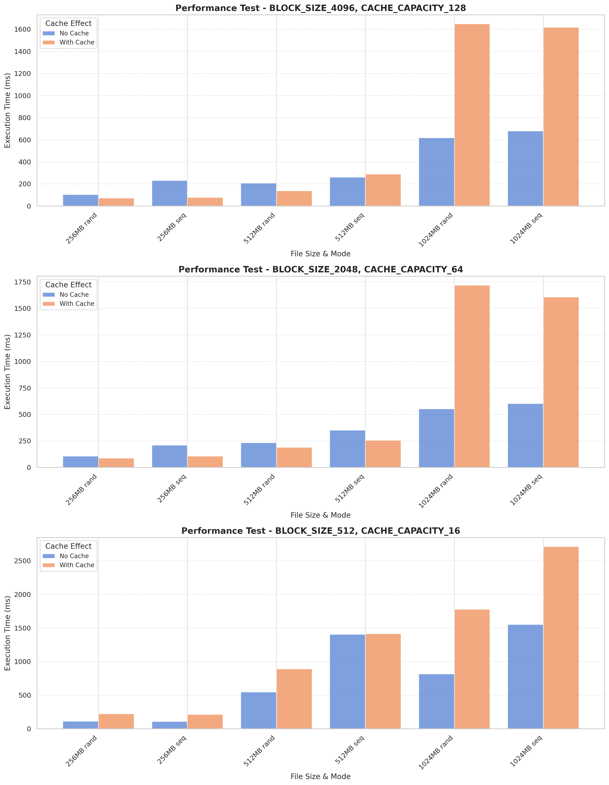

# Лабораторная работа №2
## Лукьянчук Ярослав P3323 (367361)
```json
{
  "target_os": "Linux",
  "cache_policy": "Random"
}
```

[Отчёт](./reports/report.md)  <br>
[Отчёт PDF](./reports/report.pdf) 

## Мои результаты



## Анимация


---

# Задание

Для оптимизации работы с блочными устройствами в ОС существует кэш страниц с данными, которыми мы производим операции чтения и записи на диск. Такой кэш позволяет избежать высоких задержек при повторном доступе к данным, так как операция будет выполнена с данными в RAM, а не на диске (вспомним пирамиду памяти).

В данной лабораторной работе необходимо реализовать блочный кэш в пространстве пользователя в виде динамической библиотеки (dll или so). Политику вытеснения страниц и другие элементы задания необходимо получить у преподавателя.

При выполнении работы необходимо реализовать простой API для работы с файлами, предоставляющий пользователю следующие возможности:

1. Открытие файла по заданному пути файла, доступного для чтения. Процедура возвращает некоторый хэндл на файл. Пример:
`int lab2_open(const char *path).`

2. Закрытие файла по хэндлу. Пример:
`int lab2_close(int fd).`

3. Чтение данных из файла. Пример:
`ssize_t lab2_read(int fd, void buf[.count], size_t count).`

4. Запись данных в файл. Пример:
`ssize_t lab2_write(int fd, const void buf[.count], size_t count).`

5. Перестановка позиции указателя на данные файла. Достаточно поддержать только абсолютные координаты. Пример:
​​​​​​​`off_t lab2_lseek(int fd, off_t offset, int whence).`

6. Синхронизация данных из кэша с диском. Пример:
`int lab2_fsync(int fd).`

Операции с диском разработанного блочного кеша должны производиться в обход page cache используемой ОС.

В рамках проверки работоспособности разработанного блочного кэша необходимо адаптировать указанную преподавателем программу-загрузчик из ЛР 1, добавив использование кэша. Запустите программу и убедитесь, что она корректно работает. Сравните производительность до и после.

## Ограничения

- Программа (комплекс программ) должна быть реализован на языке C или C++.

- Запрещено использовать высокоуровневые абстракции над системными вызовами. Необходимо использовать, в случае Unix, процедуры libc.

