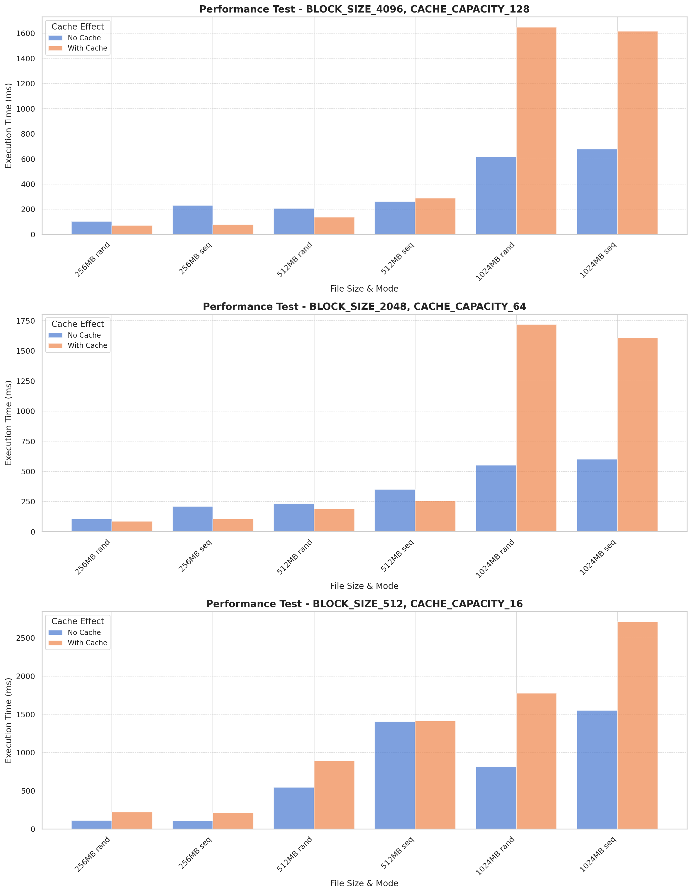

# Отчет по лабораторной работе № 2
---


[Репозиторий лабораторной.](https://github.com/bassceo/lru-cache)

```JSON
{
  "target_os": "Linux",
  "cache_policy": "Random"
}
```


# Задание

Для оптимизации работы с блочными устройствами в ОС существует кэш страниц с данными, которыми мы производим операции чтения и записи на диск. Такой кэш позволяет избежать высоких задержек при повторном доступе к данным, так как операция будет выполнена с данными в RAM, а не на диске (вспомним пирамиду памяти).

В данной лабораторной работе необходимо реализовать блочный кэш в пространстве пользователя в виде динамической библиотеки (dll или so). Политику вытеснения страниц и другие элементы задания необходимо получить у преподавателя.

При выполнении работы необходимо реализовать простой API для работы с файлами, предоставляющий пользователю следующие возможности:

1. Открытие файла по заданному пути файла, доступного для чтения. Процедура возвращает некоторый хэндл на файл. Пример:
`int lab2_open(const char *path).`

2. Закрытие файла по хэндлу. Пример:
`int lab2_close(int fd).`

3. Чтение данных из файла. Пример:
`ssize_t lab2_read(int fd, void buf[.count], size_t count).`

4. Запись данных в файл. Пример:
`ssize_t lab2_write(int fd, const void buf[.count], size_t count).`

5. Перестановка позиции указателя на данные файла. Достаточно поддержать только абсолютные координаты. Пример:
​​​​​​​`off_t lab2_lseek(int fd, off_t offset, int whence).`

6. Синхронизация данных из кэша с диском. Пример:
`int lab2_fsync(int fd).`

Операции с диском разработанного блочного кеша должны производиться в обход page cache используемой ОС.

В рамках проверки работоспособности разработанного блочного кэша необходимо адаптировать указанную преподавателем программу-загрузчик из ЛР 1, добавив использование кэша. Запустите программу и убедитесь, что она корректно работает. Сравните производительность до и после.

## Ограничения

- Программа (комплекс программ) должна быть реализован на языке C или C++.

- Запрещено использовать высокоуровневые абстракции над системными вызовами. Необходимо использовать, в случае Unix, процедуры libc.

# Краткий обзор кода

## 1. Общая идея


- **Lab2File** – структура, хранящая основную информацию:

  - `fd` — реальный файловый дескриптор.
  - `file_size` — текущий размер реального файла.
  - `offset` — «курсор» (смещение для чтения/записи).
  - `cache_count` — число блоков, сейчас находящихся в кэше.
  - `hash_table` — массив «корзин» для хеширования блоков (размер `CACHE_CAPACITY`).

- **CacheBlock** – структура, описывающая один блок кэша. Содержит:

  - `block_number` — номер блока в файле (каждый блок по умолчанию `BLOCK_SIZE` байт).
  - `data` — указатель на выделенную память под данные блока.
  - `dirty` — флаг «грязности» (true, если данные в блоке ещё не записаны на диск).
  - `next_hash` — указатель на следующий блок в цепочке хеш-таблицы.

- При **чтении** или **записи** данных:

  1. Вычисляется номер блока `block_num = offset / BLOCK_SIZE`.
  2. В хеш-таблице ищется блок (функция `find_block`).
     - Если блока нет, он подгружается (`load_block`), при необходимости вытесняя «случайный» блок (функция `evict_block`).
  3. Производится копирование данных (чтение или запись) в/из `CacheBlock->data`.
  4. Если данные были записаны, блок помечается «грязным» (`dirty = true`).

- При **закрытии** (`lab2_close`) или при явном вызове `lab2_fsync` все «грязные» блоки (из хеш-цепочек, хотя в текущем упрощённом коде обрабатывается лишь первая «корзина») дозаписываются на диск.

## 2. Обзор кода

## Вспомогательные функции

### static unsigned hash_off(off_t block_number)

```c
static unsigned hash_off(off_t block_number) {
    return (unsigned)(block_number % CACHE_CAPACITY);
}
```

- **Зачем**: вычисляет индекс корзины в хеш-таблице, используя операцию `block_number % CACHE_CAPACITY`.

### static void remove_from_hash(Lab2File *f, CacheBlock *b)

```c
static void remove_from_hash(Lab2File *f, CacheBlock *b) {
    unsigned i = hash_off(b->block_number);
    CacheBlock *p = f->hash_table[i], *prevp = NULL;
    while (p) {
        if (p == b) {
            if (!prevp) f->hash_table[i] = p->next_hash;
            else prevp->next_hash = p->next_hash;
            return;
        }
        prevp = p;
        p = p->next_hash;
    }
}
```

- **Зачем**: удаляет блок `b` из соответствующей цепочки хеш-таблицы.  
- **Как**: находит блок в списке `hash_table[i]` и убирает из связанного списка `next_hash`.

### static CacheBlock* evict_block(Lab2File *f)

```c
static CacheBlock* evict_block(Lab2File *f) {
    if (f->cache_count == 0) return NULL;
    
    unsigned bucket = rand() % CACHE_CAPACITY;
    unsigned original_bucket = bucket;
    CacheBlock *b = NULL;
    CacheBlock *prev = NULL;

    while (!f->hash_table[bucket] && bucket < CACHE_CAPACITY) bucket++;
    if (bucket == CACHE_CAPACITY) {
        bucket = 0;
        while (!f->hash_table[bucket] && bucket < original_bucket) bucket++;
    }

    if (!f->hash_table[bucket]) return NULL;

    b = f->hash_table[bucket];
    if (b->dirty) {
        off_t off = b->block_number * BLOCK_SIZE;
        pwrite(f->fd, b->data, BLOCK_SIZE, off);
    }

    f->hash_table[bucket] = b->next_hash;
    f->cache_count--;
    return b;
}
```

- **Зачем**: при переполнении кэша освобождает место, выбрав **случайную «корзину»** (и затем конкретный блок) для вытеснения.  
- **Как**:
  1. Генерирует случайное число `rand() % CACHE_CAPACITY`.
  2. В выбранной (или последующих) корзинах хеш-таблицы ищет первый доступный (непустой) блок.
  3. Если блок «грязный», записывает его на диск.
  4. Удаляет найденный блок из хеш-цепочки (и уменьшает `cache_count`).

### static CacheBlock* find_block(Lab2File *f, off_t block_num)

```c
static CacheBlock* find_block(Lab2File *f, off_t block_num) {
    unsigned i = hash_off(block_num);
    CacheBlock *b = f->hash_table[i];
    while (b) {
        if (b->block_number == block_num) return b;
        b = b->next_hash;
    }
    return NULL;
}
```

- **Зачем**: ищет нужный блок в кэше (хеш-таблице).  
- **Как**: берёт индекс корзины через `hash_off(block_num)` и идёт по списку `next_hash`, пока не найдёт блок с номером `block_num`.

### static CacheBlock* load_block(Lab2File *f, off_t block_num)

```c
static CacheBlock* load_block(Lab2File *f, off_t block_num) {
    if (f->cache_count >= CACHE_CAPACITY) {
        CacheBlock *victim = evict_block(f);
        if (victim) {
            free(victim->data);
            free(victim);
        }
    }
    CacheBlock *b = malloc(sizeof(CacheBlock));
    posix_memalign((void**)&b->data, BLOCK_SIZE, BLOCK_SIZE);
    b->block_number = block_num;
    b->dirty = false;
    b->next_hash = NULL;
    {
        off_t off = block_num * BLOCK_SIZE;
        ssize_t r = pread(f->fd, b->data, BLOCK_SIZE, off);
        if (r < 0) memset(b->data, 0, BLOCK_SIZE);
        else if (r < BLOCK_SIZE) memset(b->data + r, 0, BLOCK_SIZE - r);
    }
    {
        unsigned i = hash_off(block_num);
        b->next_hash = f->hash_table[i];
        f->hash_table[i] = b;
    }
    f->cache_count++;
    return b;
}
```

- **Зачем**: загружает блок из файла в кэш, если блок ещё не в хеш-таблице.  
- **Как**:
  1. Если кэш переполнен (`cache_count == CACHE_CAPACITY`), вызывает `evict_block`, затем освобождает память вытеснённого блока.
  2. Выделяет `CacheBlock` и память под `data`.
  3. Считывает с диска нужные данные (через `pread`).
  4. Добавляет блок в начало цепочки соответствующей корзины `hash_table[i]`.
  5. Увеличивает счётчик `cache_count`.

---

## Основные интерфейсные функции

### int lab2_open(const char *path)

```c
int lab2_open(const char *path) {
    static bool seed_initialized = false;
    if (!seed_initialized) {
        srand(time(NULL));
        seed_initialized = true;
    }

    int real_fd = open(path, O_CREAT | O_RDWR | O_DIRECT, 0666);
    if (real_fd < 0) return -1;
    Lab2File *lf = malloc(sizeof(Lab2File));
    memset(lf, 0, sizeof(Lab2File));
    lf->fd = real_fd;
    lf->offset = 0;
    lf->cache_count = 0;
    memset(lf->hash_table, 0, sizeof(lf->hash_table));
    lf->file_size = lseek(real_fd, 0, SEEK_END);
    files[file_index] = lf;
    file_index++;
    return file_index - 1;
}
```

- **Зачем**: открывает (или создаёт) реальный файл и инициализирует структуру `Lab2File`.  
- **Как**:
  1. Инициализирует `rand(...)` при первом вызове, чтобы стратегия вытеснения была действительно «случайной».
  2. Вызывает `open` с флагами `O_CREAT | O_RDWR | O_DIRECT`.
  3. Выделяет `Lab2File` и обнуляет все поля.
  4. Запоминает реальный `fd`, через `lseek` определяет размер файла, кладёт структуру в глобальный массив `files[]`.

### int lab2_close(int fd)

```c
int lab2_close(int fd) {
    Lab2File *f = get_file(fd);
    if (!f) return -1;
    for (;;) {
        CacheBlock *b = f->hash_table[0];
        if (!b) break;
        if (b->dirty) {
            off_t off = b->block_number * BLOCK_SIZE;
            pwrite(f->fd, b->data, BLOCK_SIZE, off);
        }
        remove_from_hash(f, b);
        free(b->data);
        free(b);
    }
    close(f->fd);
    free(f);
    files[fd] = NULL;
    return 0;
}
```

- **Зачем**: закрывает файл, а также сбрасывает «грязные» блоки на диск и освобождает память.  
- **Как**:
  1. Получает `Lab2File` через `get_file`.
  2. В упрощённом варианте — обрабатывает блоки, хранящиеся (по коду) лишь в `hash_table[0]`.
  3. Если блок «грязный», выполняет `pwrite` на диск.
  4. Удаляет блок из хеш-таблицы, освобождает память.
  5. Закрывает реальный дескриптор `close(f->fd)`.
  6. Удаляет запись из `files[]`.

### ssize_t lab2_read(int fd, void *buf, size_t count)

```c
ssize_t lab2_read(int fd, void *buf, size_t count) {
    Lab2File *f = get_file(fd);
    if (!f) return -1;

    if (f->offset >= f->file_size) {
        return 0;
    }

    if (f->offset + count > f->file_size) {
        count = f->file_size - f->offset;
    }

    size_t total = 0;
    char *p = buf;
    while (count > 0) {
        off_t bn = f->offset / BLOCK_SIZE;
        size_t off = f->offset % BLOCK_SIZE;
        size_t can_read = BLOCK_SIZE - off;
        if (can_read > count) {
            can_read = count;
        }
        CacheBlock *b = find_block(f, bn);
        if (!b) {
            b = load_block(f, bn);
        }
        memcpy(p, b->data + off, can_read);
        total += can_read;
        p += can_read;
        f->offset += can_read;
        count -= can_read;
    }
    return total;
}
```

- **Зачем**: читать данные из кэша, подгружая нужные блоки, если их нет в хеш-таблице.  
- **Как**:
  1. Проверяет, не вышли ли за конец файла.
  2. При необходимости уменьшает `count`, чтобы не читать «за файл».
  3. В цикле разбивает чтение на куски размером `BLOCK_SIZE - off` (учитывая смещение внутри блока).
  4. Если нужного блока нет в кэше, вызывает `load_block`.
  5. Копирует данные из `b->data` в пользовательский буфер.
  6. Обновляет `offset` и уменьшает `count` до полного чтения.

### ssize_t lab2_write(int fd, const void *buf, size_t count)

```c
ssize_t lab2_write(int fd, const void *buf, size_t count) {
    Lab2File *f = get_file(fd);
    if (!f) return -1;
    size_t total = 0;
    const char *p = buf;
    while (count > 0) {
        off_t bn = f->offset / BLOCK_SIZE;
        size_t off = f->offset % BLOCK_SIZE;
        size_t can_write = BLOCK_SIZE - off;
        if (can_write > count) can_write = count;
        CacheBlock *b = find_block(f, bn);
        if (!b) {
            if (off != 0 || can_write < BLOCK_SIZE) b = load_block(f, bn);
            else {
                if (f->cache_count >= CACHE_CAPACITY) {
                    CacheBlock *victim = evict_block(f);
                    if (victim) {
                        free(victim->data);
                        free(victim);
                    }
                }
                b = malloc(sizeof(CacheBlock));
                posix_memalign((void**)&b->data, BLOCK_SIZE, BLOCK_SIZE);
                memset(b->data, 0, BLOCK_SIZE);
                b->block_number = bn;
                b->dirty = false;
                b->next_hash = NULL;
                {
                    unsigned i = hash_off(bn);
                    b->next_hash = f->hash_table[i];
                    f->hash_table[i] = b;
                }
                f->cache_count++;
            }
        }
        memcpy(b->data + off, p, can_write);
        b->dirty = true;
        total += can_write;
        p += can_write;
        f->offset += can_write;
        if (f->offset > f->file_size) f->file_size = f->offset;
        count -= can_write;
        if (f->cache_count > CACHE_CAPACITY) {
            CacheBlock *victim = evict_block(f);
            if (victim) {
                free(victim->data);
                free(victim);
            }
        }
    }
    return total;
}
```

- **Зачем**: записывает данные через кэш, создавая/загружая блоки при необходимости.  
- **Как**:
  1. Разбивает `count` на части, чтобы корректно заполнить блоки (с учётом смещения `off`).
  2. Ищет блок в кэше (через `find_block`). Если нет:
     - Если нужно частично изменить блок (не переписывая весь 512/2048/4096 байт), то его подгружают (`load_block`).
     - Если переписывается весь блок, создают новый (при необходимости предварительно вытесняют по `evict_block`).
  3. Записывает данные в `b->data`, ставит флаг `dirty = true`.
  4. Обновляет `offset` и при необходимости `file_size`.
  5. Если кэш переполнен, снова вызывает `evict_block`.

### off_t lab2_lseek(int fd, off_t offset, int whence)

```c
off_t lab2_lseek(int fd, off_t offset, int whence) {
    Lab2File *f = get_file(fd);
    if (!f) return -1;
    off_t new_off;
    if (whence == SEEK_SET) new_off = offset;
    else if (whence == SEEK_CUR) new_off = f->offset + offset;
    else if (whence == SEEK_END) new_off = f->file_size + offset;
    else return -1;
    if (new_off < 0) return -1;
    f->offset = new_off;
    return f->offset;
}
```

- **Зачем**: изменяет «курсор» (смещение) в файле.  
- **Как**:
  1. Вычисляет новое смещение `new_off` в зависимости от `whence`.
  2. Проверяет, не ушло ли в «отрицательную» зону.
  3. Сохраняет новое смещение в `f->offset`.

### int lab2_fsync(int fd)

```c
int lab2_fsync(int fd) {
    Lab2File *f = get_file(fd);
    if (!f) return -1;
    CacheBlock *b = f->hash_table[0];
    while (b) {
        if (b->dirty) {
            off_t off = b->block_number * BLOCK_SIZE;
            pwrite(f->fd, b->data, BLOCK_SIZE, off);
            b->dirty = false;
        }
        b = b->next_hash;
    }
    fsync(f->fd);
    return 0;
}
```

- **Зачем**: гарантирует, что «грязные» блоки будут сброшены на диск.  
- **Как**:
  1. Проходит по цепочке блоков в корзине `hash_table[0]` (в упрощённом примере).
  2. Если блок помечен как `dirty`, записывает его (`pwrite`).
  3. Сбрасывает системные буферы диска командой `fsync`.
  4. Возвращает 0 при успехе или -1 при ошибке.

---

## Результаты тестов

```Shell
       _,met$$$$$gg.          debian@debian 
    ,g$$$$$$$$$$$$$$$P.       ------------- 
  ,g$$P"     """Y$$.".        OS: Debian GNU/Linux 12 (bookworm) aarch64 
 ,$$P'              `$$$.     Host: QEMU Virtual Machine virt-7.2 
',$$P       ,ggs.     `$$b:   Kernel: 6.1.0-28-arm64 
`d$$'     ,$P"'   .    $$$    Uptime: 1 hour, 49 mins 
 $$P      d$'     ,    $$P    Packages: 1670 (dpkg) 
 $$:      $$.   -    ,d$$'    Shell: bash 5.2.15 
 $$;      Y$b._   _,d$P'      Resolution: 1800x1126 
 Y$$.    `.`"Y$$$$P"'         DE: GNOME 43.9 
 `$$b      "-.__              WM: Mutter 
  `Y$$                        WM Theme: Adwaita 
   `Y$$.                      Theme: Adwaita [GTK2/3] 
     `$$b.                    Icons: Adwaita [GTK2/3] 
       `Y$$b.                 Terminal: vscode 
          `"Y$b._             CPU: (6) 
              `"""            GPU: 00:02.0 Red Hat, Inc. Virtio 1.0 GPU 
                              Memory: 1750MiB / 3921MiB 
```



```C
#define BLOCK_SIZE 4096
#define CACHE_CAPACITY 128
```

```Shell
===================================================
              Performance Test Suite                 
===================================================

Test 1: Random Cache Performance Test
Description: Evaluating cache performance with different
file sizes and access patterns (sequential and random)
===================================================

Size(MB) | Mode  | Run | no_cache(ms) | with_cache(ms)
------------------------------------------------------
256      | seq |  1  | 491.45       | 92.18
256      | seq |  2  | 101.58       | 70.16
256      | seq |  3  | 102.97       | 75.17
256      | rand |  1  | 121.36       | 73.42
256      | rand |  2  | 100.69       | 71.99
256      | rand |  3  | 93.68       | 70.88
512      | seq |  1  | 292.29       | 549.92
512      | seq |  2  | 238.48       | 183.01
512      | seq |  3  | 256.95       | 137.56
512      | rand |  1  | 211.64       | 132.88
512      | rand |  2  | 208.63       | 148.89
512      | rand |  3  | 202.37       | 135.70
1024      | seq |  1  | 718.32       | 2042.54
1024      | seq |  2  | 787.87       | 1615.19
1024      | seq |  3  | 531.55       | 1196.86
1024      | rand |  1  | 712.03       | 1654.34
1024      | rand |  2  | 504.44       | 1777.25
1024      | rand |  3  | 635.20       | 1516.78

===================================================
Test 2: External Integer Sorting Test
Description: Testing the performance of external
merge sort implementation for integer arrays
===================================================
 total_ints | chunk_size |   sys_time(ms)  |  lab2_time(ms)
------------+------------+-----------------+----------------
      20000 |       2000 |           71.76 |           4.97
      50000 |       5000 |          133.32 |           5.73
     100000 |      10000 |          301.88 |          17.58
```

```C
#define BLOCK_SIZE 2048 
#define CACHE_CAPACITY 64
```

```Shell
===================================================
              Performance Test Suite                 
===================================================

Test 1: Random Cache Performance Test
Description: Evaluating cache performance with different
file sizes and access patterns (sequential and random)
===================================================

Size(MB) | Mode  | Run | no_cache(ms) | with_cache(ms)
------------------------------------------------------
256      | seq |  1  | 362.07       | 125.31
256      | seq |  2  | 142.81       | 96.68
256      | seq |  3  | 127.58       | 96.85
256      | rand |  1  | 137.56       | 94.92
256      | rand |  2  | 106.46       | 83.68
256      | rand |  3  | 78.35       | 82.59
512      | seq |  1  | 390.22       | 328.24
512      | seq |  2  | 350.88       | 222.69
512      | seq |  3  | 311.98       | 217.34
512      | rand |  1  | 286.27       | 202.36
512      | rand |  2  | 200.31       | 175.66
512      | rand |  3  | 213.97       | 193.87
1024      | seq |  1  | 570.93       | 1873.10
1024      | seq |  2  | 475.44       | 1664.30
1024      | seq |  3  | 765.09       | 1283.63
1024      | rand |  1  | 664.53       | 1694.84
1024      | rand |  2  | 467.26       | 1592.68
1024      | rand |  3  | 524.75       | 1871.62

===================================================
Test 2: External Integer Sorting Test
Description: Testing the performance of external
merge sort implementation for integer arrays
===================================================
 total_ints | chunk_size |   sys_time(ms)  |  lab2_time(ms)
------------+------------+-----------------+----------------
      20000 |       2000 |          105.52 |           7.70
      50000 |       5000 |          140.38 |           7.14
     100000 |      10000 |          279.05 |          10.49
```

```C
#define BLOCK_SIZE 512
#define CACHE_CAPACITY 16
```

```Shell
===================================================
              Performance Test Suite                 
===================================================

Test 1: Random Cache Performance Test
Description: Evaluating cache performance with different
file sizes and access patterns (sequential and random)
===================================================

Size(MB) | Mode  | Run | no_cache(ms) | with_cache(ms)
------------------------------------------------------
256      | seq |  1  | 149.61       | 222.79
256      | seq |  2  | 89.89       | 206.74
256      | seq |  3  | 83.98       | 213.78
256      | rand |  1  | 88.78       | 211.10
256      | rand |  2  | 91.68       | 204.89
256      | rand |  3  | 162.25       | 251.19
512      | seq |  1  | 1337.95       | 2230.27
512      | seq |  2  | 2471.07       | 1319.68
512      | seq |  3  | 405.25       | 692.60
512      | rand |  1  | 748.80       | 927.81
512      | rand |  2  | 222.59       | 969.03
512      | rand |  3  | 673.48       | 774.97
1024      | seq |  1  | 2632.20       | 4022.87
1024      | seq |  2  | 1296.18       | 1643.81
1024      | seq |  3  | 727.21       | 2469.39
1024      | rand |  1  | 1621.01       | 1955.51
1024      | rand |  2  | 424.81       | 1889.53
1024      | rand |  3  | 406.25       | 1496.95

===================================================
Test 2: External Integer Sorting Test
Description: Testing the performance of external
merge sort implementation for integer arrays
===================================================
 total_ints | chunk_size |   sys_time(ms)  |  lab2_time(ms)
------------+------------+-----------------+----------------
      20000 |       2000 |           66.83 |           4.16
      50000 |       5000 |          168.98 |          15.27
     100000 |      10000 |          372.58 |          34.72
```

### Анализ результатов

1. **Test 1 (Random Cache Performance Test)**
   - При **маленьких файлах** (256 MB, иногда 512 MB) кэш даёт прирост скорости, особенно при BLOCK_SIZE=4096 и CACHE_CAPACITY=128.
   - При **больших файлах** (1024 MB) «with_cache» работает **медленнее** «no_cache» из-за частых промахов и копирования блоков.
   - С уменьшением **BLOCK_SIZE и CACHE_CAPACITY** (512 байт и 16 блоков) кэш может замедлять работу, так как блоки часто вытесняются.

2. **Test 2 (External Integer Sorting Test)**
   - Везде «lab2_time» **быстрее** «sys_time», значит, пользовательский кэш эффективнее системного.
   - С ростом количества данных общее время увеличивается, но **разница между методами сохраняется**.

## Выводы
   - **Кэш с стратегией Random полезен** для средних размеров файлов, но теряет эффективность при больших объёмах и случайном вытеснении.
   - **Выбор BLOCK_SIZE и CACHE_CAPACITY критичен** – слишком маленькие или большие значения могут ухудшить результат.
   - **Внешняя сортировка выигрывает** от пользовательского кэша, так как доступ к данным предсказуем.
   - **Random вытеснение не всегда удачно** – может убирать нужные блоки, снижая производительность.

В целом, кэш с стратегией Random ускоряет работу при повторных обращениях, но его настройки должны соответствовать размеру данных.